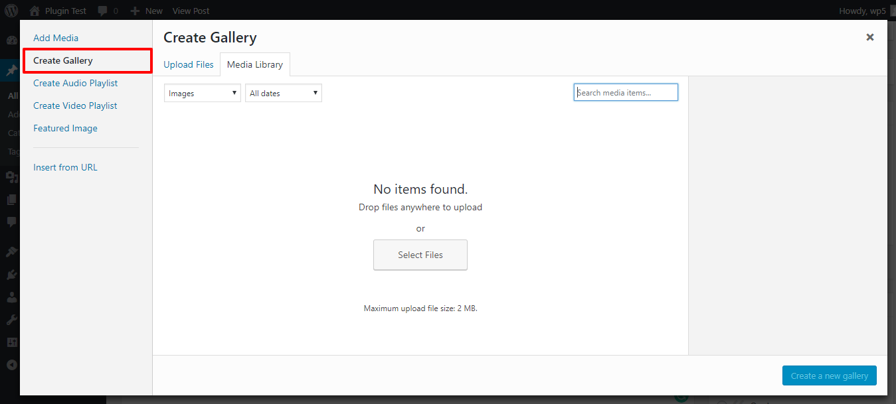
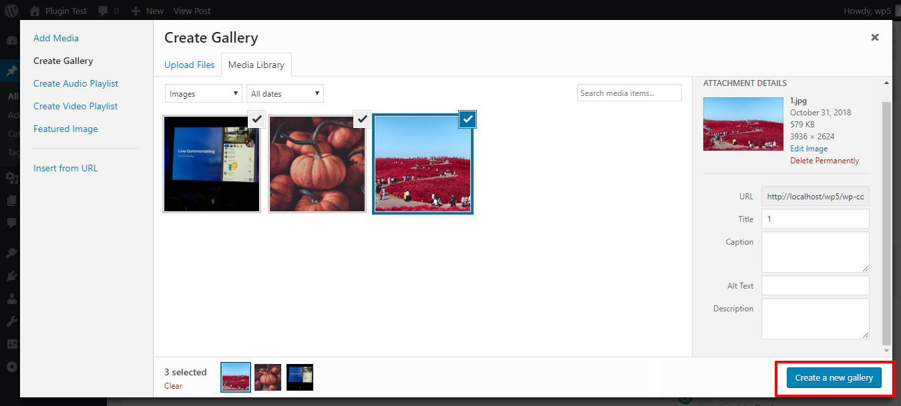
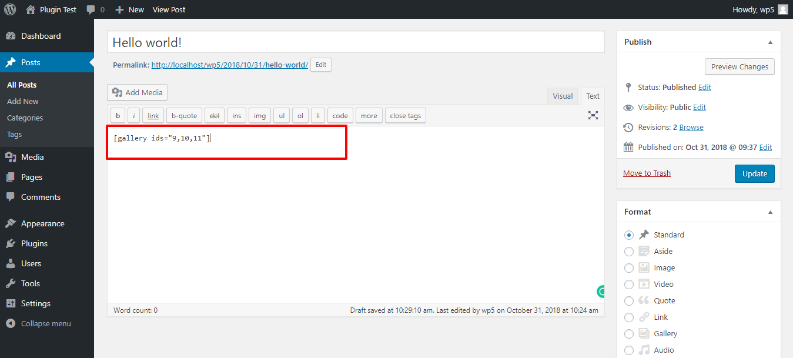
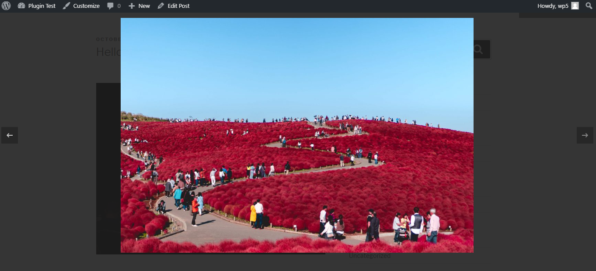
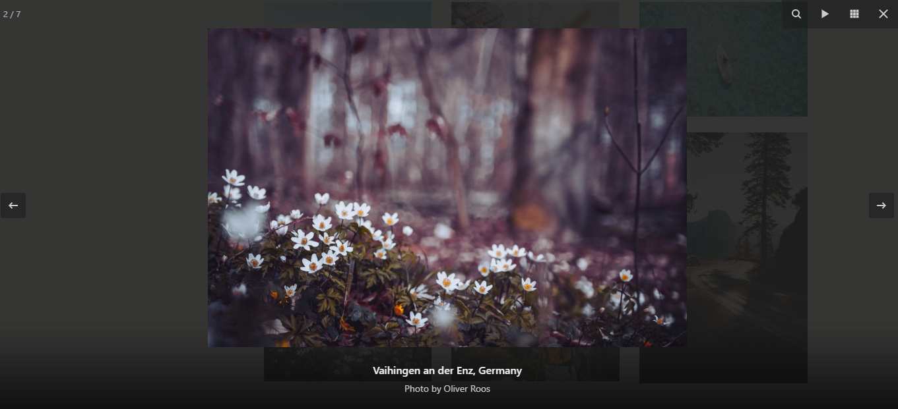

#  WordPress Fancybox Gallery Plugin #
Contributors: Flying Cursor, Ajay Maurya
Tags: WordPress Gallery, Fancybox 3, WordPress Fancybox Gallery, Lightbox Gallery, Gallery Popup, Gallery Slideshow
Donate link: https://flyingcursor.com/
Requires at least: 2.6.3
Tested up to: 4.9.8
Stable tag: 1.0.0
License: GNU General Public License v3.0
License URI: https://www.gnu.org/licenses/gpl-3.0.en.html

WP Post Gallery Fancybox is a WordPress plugin that converts the default WordPress Media Gallery into a Fancybox Gallery.

##  Description ## 
WP Post Gallery Fancybox  is a WordPress plugin that converts the default WordPress Media Gallery into a Fancybox Gallery.

Just add the gallery shortcode to display the thumbnails in your posts/pages and this plugin does the rest, It makes your gallery to appear as a Fancybox Gallery.

<a href="https://fancyapps.com/fancybox/3/#images-1" target="_blank">Demo of Fancybox</a>

Touch Enabled and Fully Responsive Lightbox.
Slideshow and Full screen options available.

##  Features ## 
* Mobile optimized
* Responsive, touch-enabled and customizable.
* Multiple instances (Add Multiple Galleries on a single page)

##  Installation ## 
1. Unzip and upload contents of the plugin to your '/wp-content/plugins/' directory
2. Activate the plugin through the 'Plugins' menu in WordPress

##  Credits ## 
The FancyBox jQuery plugin is written by Janis Skarnelis:
https://fancyapps.com/fancybox/3/

##  Frequently Asked Questions ## 
### What browsers are supported? ###

1. Chrome
2. Firefox
3. IE10/11
4. Edge
5. iOS Safari
6. Android 7.0 Tablet

### jQuery Dependencies ###

jQuery 3+ is preferred, but fancybox works with jQuery 1.9.1+ and jQuery 2+

### Can I use captions on each images ###

Yes, WP Post Gallery Fancybox 3 plugin displays the images captions as a Fancybox slide captions.

### What if WP Gallery Fancybox doesn't work for any reason? What would visitors see? ###

A visitor would see the default WordPress Gallery

### What licensing terms are associated with WP Post Gallery Fancybox 3? ###

WP Post Gallery Fancybox 3 is Licensed under the Apache License, Version 3.0 (the "License").
Please visit (https://www.gnu.org/licenses/gpl-3.0.en.html) for details.

### Screenshots ###

1. Create default WordPress Media Gallery.

2. Select Multiple images and insert in Post / Page.

3. Rearrange the images as per your choice.

4. Slidehow gallery on Post/Page.

5. Image Captions are displayed as slideshow captions.

## Changelog ##
### 1.0.0 ###
* First Public Release.
